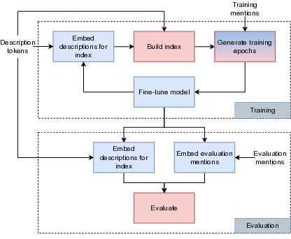
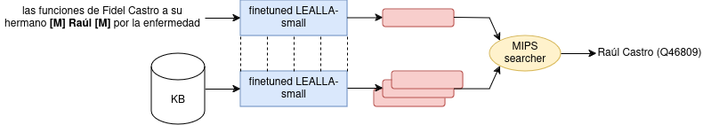

# Multilingual Entity Linking

This repository contains implementations of multiple approaches to multilingual entity linking.
If you don't know what entity linking is or would like to know more about the methods used, take a look at 
my thesis: entity linking and its history are described [here](https://arxiv.org/pdf/2406.16892#chapter.2) and 
training models in the following [chapters](https://arxiv.org/pdf/2406.16892#chapter.4).

Right now, it is rather hard to run the repository locally.
In the upcoming year, it should become a part of [LinPipe](https://github.com/ufal/linpipe) so all the controlling
will be done through it.

## Results

### Finetuning 


#### Standard

**pre-limenary results (old data)**

| Language | Recall@1 | Recall@10 | Recall@100 |
|----------|----------|-----------|------------|
| Arabic   |   91.1   |   94.3    |    95.1    |
| German   |   90.6   |   94.8    |    95.6    |
| English  |   85.8   |   91.6    |    93.3    |
| Spanish  |   88.1   |   93.4    |    94.6    |
| Persian  |   89.0   |   95.5    |    97.0    |
| Japanese |   87.6   |   94.2    |    95.9    |
| Serbian  |   91.6   |   96.1    |    97.0    |
| Tamil    |   90.0   |   96.4    |    97.7    |
| Turkish  |   87.3   |   93.4    |    94.6    |

### OLPEAT (old data)

| Language | Recall@1 | Recall@10 | Recall@100 |
|----------|----------|-----------|------------|
| Arabic   |   90.1   |   93.3    |    94.4    |
| German   |   89.1   |   93.3    |    94.3    |
| English  |   80.3   |   88.9    |    91.4    |
| Spanish  |   84.5   |   91.2    |    92.5    |
| Persian  |   83.0   |   89.3    |    91.4    |
| Japanese |   85.7   |   93.7    |    94.9    |
| Serbian  |   91.2   |   95.3    |    96.4    |
| Tamil    |   91.4   |   95.5    |    97.3    |
| Turkish  |   86.4   |   93.9    |    94.6    |

For OLPEAT explanation click [here](https://arxiv.org/pdf/2406.16892#section.6.4).


### Alias table

| Language | Recall@1 | Recall@10 | Recall@100 |
|----------|----------|-----------|------------|
| Arabic   |   90.7   |   94.3    |    94.4    |
| German   |   86.9   |   93.3    |    94.1    |
| English  |   78.6   |   88.6    |    90.2    |
| Spanish  |   83.3   |   93.5    |    94.3    |
| Persian  |   86.9   |   92.2    |    92.3    |
| Japanese |   83.6   |   91.6    |    92.0    |
| Serbian  |   88.8   |   93.7    |    94.1    |
| Tamil    |   83.0   |   85.4    |    85.5    |
| Turkish  |   83.5   |   92.9    |    93.5    |


## About entity linking

Entity linking is a cute problem in NLP where your are tasked with connecting a mention to an entry in a knowledge base. For example, take the sentence "In order to save Troy, **Paris** had to be sacrificed" -- the mention Paris should connect to Paris (mythological figure) not the capital of France.

## Overview of the finetuning pipeline






## History

This repository is based on my [thesis](https://arxiv.org/abs/2406.16892); however, it implements a plateau of different improvements which were not part of the original code.
Most notably:
- supports multilingual entity linking in the style of [Entity Linking in 100 Languages](https://aclanthology.org/2020.emnlp-main.630/),
- the code is significantly faster and more memory efficient.

Other improvements are:
- completely rewritten tokenization pipeline. The previous version was pretty much impossible to extend or change and also inefficient.
- Support for different models,
- and gin-config.

## Repository structure

For the audacious ones and as a future reference for myself.

### src/scripts

Contains scripts for running everything. The most important scripts are described below.

#### damuel

Downloading and extracting damuel.

#### olpeat 

It's best to use `olpeat_all.sh` which runs OLPEAT from start to finish on tokenized DaMuEL and Mewsli-9.

#### train

`all_langs_no_slurm.sh` is the preferable way to run the code.

`all_langs.sh` requires slurm but does not provide any benefits. 
Its downside is that it requires configuring every little call to slurm sbatch which makes it time-consuming to maintain.

### source code

#### baselines

Contains various baselines inherited from the code of my thesis. 
The most important one is OLPEAT.
OLPEAT now has a cap on the number of different entity representations in the index so we cannot evaluate it 
with the same code as trained models.

#### data_processors

Some old code that is there for legacy reasons. 
Should be either moved to models or deleted. 
Implements wrappers over tokenizers and scann index.

#### finetunings

The complete finetuning logic.

##### evaluation

Most logic was already moved to `RecallCalculator` so here are some wrappers around it that make setting evaluation up easy.

##### file_processing

Utils that are needed during training. Mostly moving data around.

##### finetune_model

There are two possible entry points `train.py` and `train_ddp.py`. 
The former implements single gpu training, the latter does this with distributed data parallel.
DDP is a strongly preferred way of running things -- it's much faster and data loading logic there is improved.
`train.py` exists for legacy reasons or for times when I won't have access to a multi-gpu cluster.

##### generate_epochs

The entry point is in `generate.py` but most of the logic is in `datasets.py` -- the code in it constructs batches which
is probably the hardest thing to get right.
For performance reasons and ease of implementation we are loading all links into RAM. 
In case of OOM in generation part it is needed to make `datasets.Batcher` lazier.

#### models

- `batch_sampler.py` and `negative_sampler` implement neighbors sampling for batch and negatives respectively.
- `recall_calculator.py` used for calculating recalls in evaluation.
- `*_wrapper.py` different transformers produce the input embeddings differently (pooling, cls...). These can
wrap a transformer model and extract the embedding.

##### searchers

Different searchers that can be used to implement the index for sampling negatives during training.
- `brute_force_searcher.py` -- contains GPU based searcher (single and multi gpu). Very performant and precise.
- `scann_searcher.py` -- Based on [ScaNN](https://github.com/google-research/google-research/tree/master/scann)
performant but less precise. So far, we can put our index to a GPU so brute force is preferable. 
Properly understanding [SOAR](https://research.google/blog/soar-new-algorithms-for-even-faster-vector-search-with-scann/) could give additional performance boost.
- `faiss_searcher.py` -- currently not working well (maybe params are set horribly).

#### multilingual dataset

Code for creating multilingual dataset in style of [Entity Linking in 100 Languages](https://aclanthology.org/2020.emnlp-main.630/). The scripts from here are used once to create a multilingual dataset.

- `combine_embs.py` is a nice utility that allows us to use more than one language for entity description.
This offers modest improvements in low resource languages.

#### profiling

Helpful profiling scripts I wrote to make the code efficient.

#### reranking

WIP code for reranking results retrieved by our model.

#### scripts

Scripts for running everything. Already described above.

#### tokenization

Simple pipelines that are used for tokenizing inputs.
Adding new pipeline steps can be done easily by extending `tokenization.pipeline.base.PipelineStep`.

#### utils

Bunch of different utilities used in different parts of the codebase.

### tests

All tests are in the tests directory. 
Some slower/integration tests are marked with @pytest.mark.slow.

To run all tests just run
```
pytest
```
in the root.

To exclude slow tests, run
```
pytest -m "not slow"
```

## Running locally

Right now, `wandb` is used for tracking all experiments and there is no simple way to turn this off.
We should make it optional in the future.
